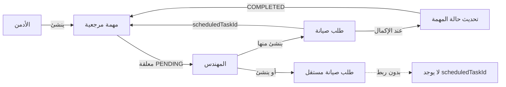
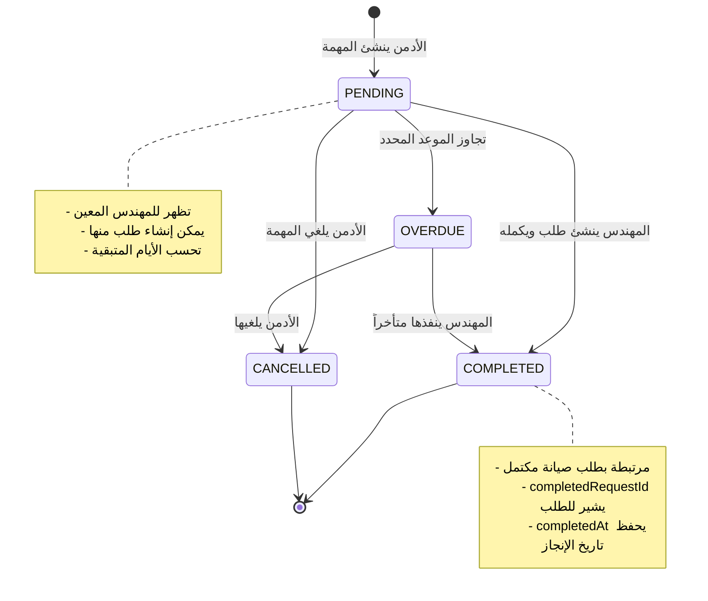
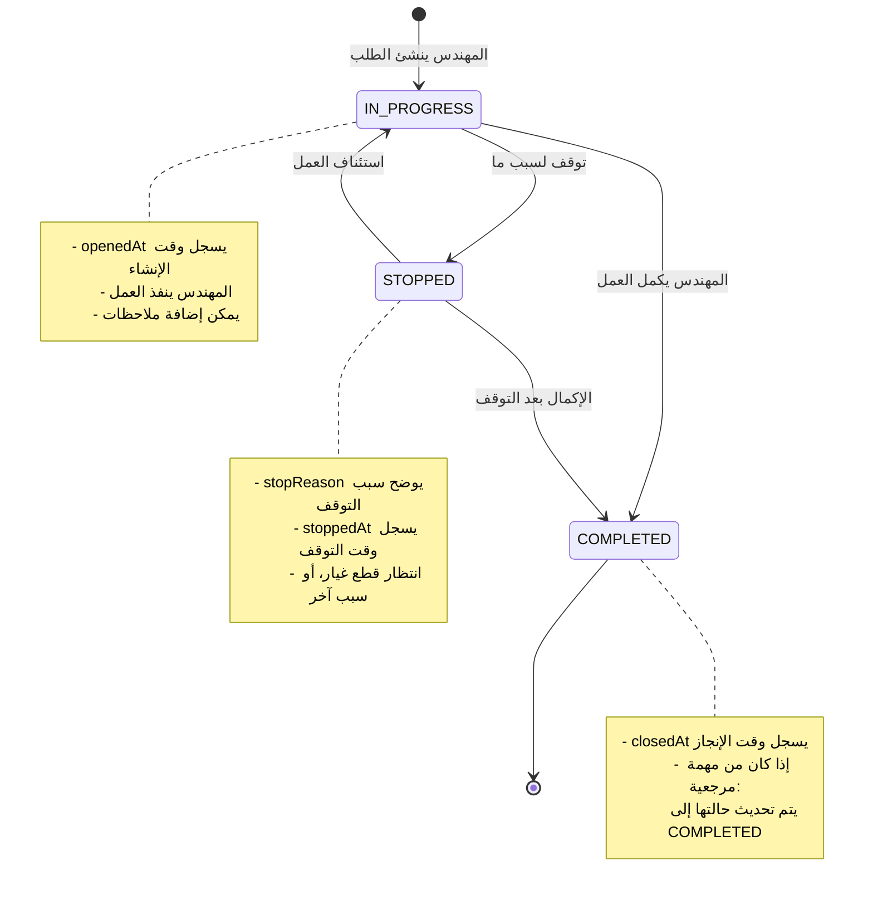
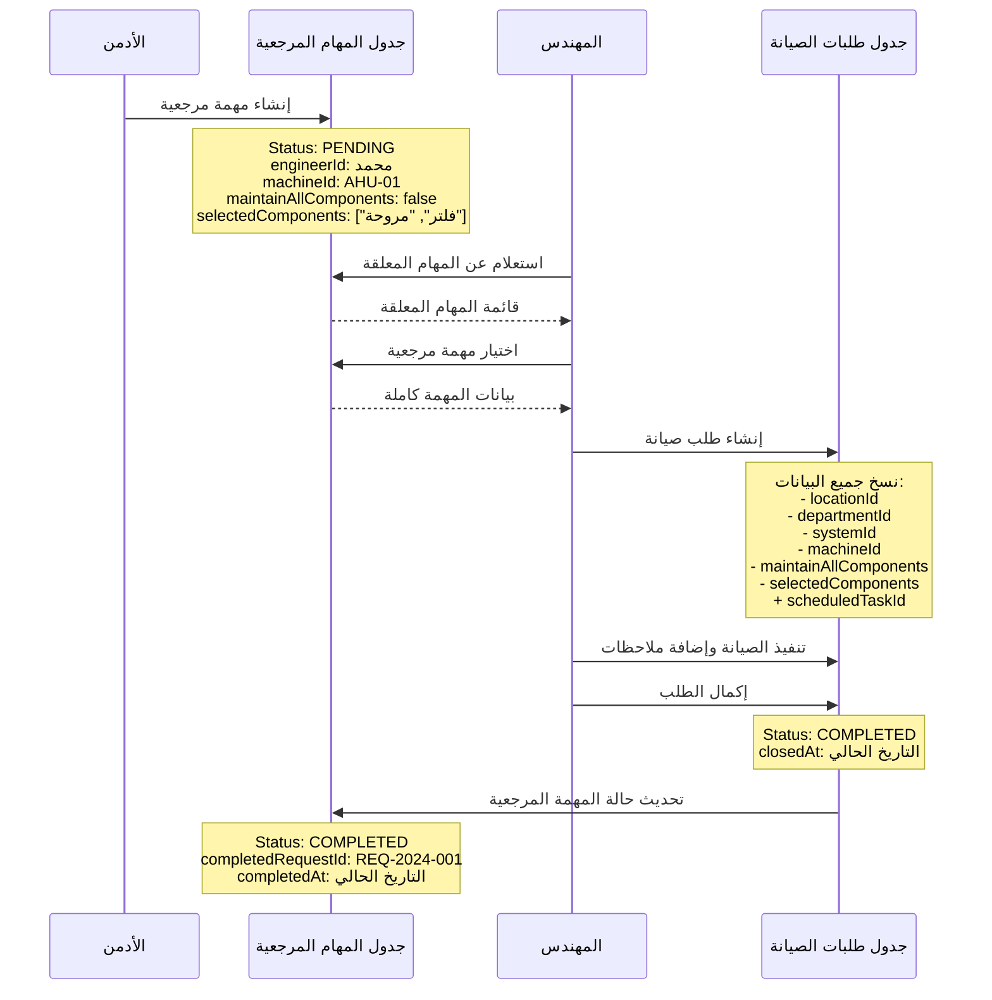
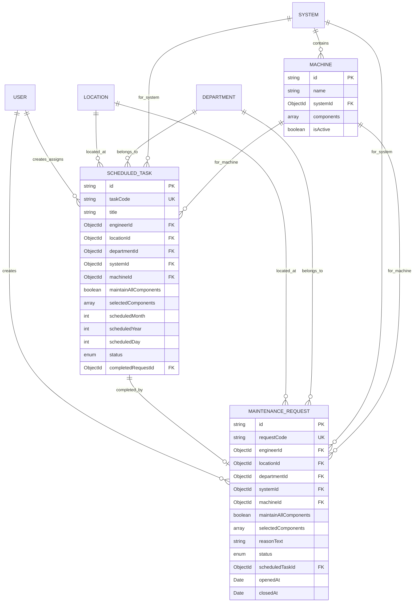

# شرح نظام المهام المرجعية وطلبات الصيانة

## جدول المحتويات

1. [المفاهيم الأساسية](#المفاهيم-الأساسية)
2. [العلاقة بين المهام المرجعية وطلبات الصيانة](#العلاقة-بين-المهام-المرجعية-وطلبات-الصيانة)
3. [نظام المكونات](#نظام-المكونات-components-system)
4. [واجهة اختيار المكونات](#واجهة-اختيار-المكونات)
5. [مخططات تفصيلية](#مخططات-تفصيلية)
6. [حالات خاصة ومهمة](#حالات-خاصة-ومهمة)
7. [ملخص العلاقات بين الكيانات](#ملخص-العلاقات-بين-الكيانات)
8. [الملفات الأساسية في النظام](#الملفات-الأساسية-في-النظام)
9. [فوائد نظام المكونات](#فوائد-نظام-المكونات)
10. [أمثلة عملية](#أمثلة-عملية)

---

## المفاهيم الأساسية

### 1. المهام المرجعية (Scheduled Tasks)

**المهام المرجعية** هي مهام صيانة **مجدولة مسبقاً** يقوم الأدمن بإنشائها للمهندسين. هذه المهام تمثل خطة صيانة استباقية ومنظمة.

**الهدف الأساسي:** تنظيم وجدولة أعمال الصيانة الدورية والوقائية للمعدات والآلات.

#### مكونات المهمة المرجعية

المهمة المرجعية تحتوي على:

- **رمز المهمة (Task Code):** معرف فريد مثل `TASK-2024-001`
- **العنوان (Title):** وصف مختصر مثل "صيانة دورية - تشيلر #5"
- **المهندس المكلف (Engineer):** المهندس المسؤول عن تنفيذ المهمة
- **البيانات المرجعية:**
  - الموقع (Location): مثل كلية الحاسوب، كلية الهندسة
  - القسم (Department): مثل ميكانيك، كهرباء
  - النظام (System): مثل تكييف، حريق، مياه
  - الآلة (Machine): مثل تشيلر، AHU، مضخة
- **نوع الصيانة (Maintenance Type):** طارئة أو وقائية
- **التاريخ المجدول (Scheduled Date):** موعد تنفيذ المهمة (يوم/شهر/سنة)
- **حالة المهمة (Status):**
  - `PENDING`: معلقة (لم تنفذ بعد)
  - `COMPLETED`: مكتملة (تم إنشاء طلب صيانة وإتمامه)
  - `OVERDUE`: متأخرة (تجاوزت الموعد المحدد)
  - `CANCELLED`: ملغاة
- **المكونات المطلوب صيانتها:**
  - `maintainAllComponents`: صيانة جميع المكونات (true/false)
  - `selectedComponents`: قائمة المكونات المحددة (إذا لم تكن الصيانة لجميع المكونات)
- **وصف إضافي (Description):** تفاصيل إضافية عن المهمة

#### من يقوم بإنشاء المهام المرجعية؟

**الأدمن فقط** هو من يستطيع:

- إنشاء مهام مرجعية جديدة
- تعديل المهام المرجعية
- حذف المهام المرجعية
- تعيين المهام للمهندسين

**الملف المسؤول:** `frontend/src/pages/admin/ScheduledTaskForm.tsx`

---

### 2. طلبات الصيانة (Maintenance Requests)

**طلبات الصيانة** هي الطلبات الفعلية التي ينشئها المهندسون لتنفيذ أعمال الصيانة.

#### أنواع طلبات الصيانة

هناك نوعان من طلبات الصيانة:

**أ) طلبات منشأة من مهام مرجعية:**

- عندما يكون للمهندس مهمة مرجعية معلقة، يمكنه إنشاء طلب صيانة منها مباشرة
- يتم ملء جميع البيانات تلقائياً من المهمة المرجعية
- يتم ربط الطلب بالمهمة المرجعية عبر `scheduledTaskId`
- عند إكمال الطلب، يتم تحديث حالة المهمة المرجعية إلى `COMPLETED`

**ب) طلبات صيانة مستقلة:**

- يمكن للمهندس إنشاء طلب صيانة جديد بدون مهمة مرجعية
- يقوم بإدخال جميع البيانات يدوياً
- هذه الطلبات تكون عادة للصيانة الطارئة أو غير المجدولة

#### مكونات طلب الصيانة

طلب الصيانة يحتوي على:

- **رمز الطلب (Request Code):** معرف فريد مثل `REQ-2024-001`
- **المهندس (Engineer):** يتم تحديده تلقائياً من حساب المهندس
- **الاستشاري (Consultant):** يتم تعيينه عند مراجعة الطلب
- **مشرف السلامة (Health Safety Supervisor):** اختياري
- **البيانات المرجعية:** (نفس المهام المرجعية)
  - الموقع، القسم، النظام، الآلة
- **نوع الصيانة:** طارئة أو وقائية
- **سبب الطلب (Reason Text):** وصف تفصيلي للمشكلة
- **رقم الآلة (Machine Number):** رقم أو كود الآلة (اختياري)
- **حالة الطلب (Status):**
  - `IN_PROGRESS`: قيد التنفيذ (الحالة الافتراضية)
  - `COMPLETED`: منتهي
  - `STOPPED`: متوقف
- **المكونات:**
  - `maintainAllComponents`: صيانة جميع المكونات
  - `selectedComponents`: المكونات المحددة
- **الملاحظات:**
  - `engineerNotes`: ملاحظات المهندس
  - `consultantNotes`: ملاحظات الاستشاري
  - `healthSafetyNotes`: ملاحظات السلامة
- **التواريخ:**
  - `openedAt`: تاريخ فتح الطلب (تلقائي)
  - `closedAt`: تاريخ إغلاق الطلب (عند الإكمال)
  - `stoppedAt`: تاريخ التوقف (إذا تم إيقاف الطلب)

**الملف المسؤول:** `frontend/src/pages/requests/NewRequest.tsx`

---

## العلاقة بين المهام المرجعية وطلبات الصيانة



### سيناريو العمل

#### السيناريو الأول: مهمة مرجعية → طلب صيانة

1. الأدمن ينشئ مهمة مرجعية لصيانة تشيلر في يناير 2025
2. المهمة تظهر للمهندس المعين في قائمة "المهام المرجعية المعلقة"
3. المهندس يضغط على المهمة، فتملأ جميع البيانات تلقائياً في نموذج طلب الصيانة
4. المهندس يراجع البيانات ويضيف ملاحظاته ويرسل الطلب
5. الطلب يحتوي على `scheduledTaskId` الذي يربطه بالمهمة المرجعية
6. عندما يكمل المهندس الطلب، يتم تحديث حالة المهمة المرجعية إلى `COMPLETED`

#### السيناريو الثاني: طلب صيانة مستقل

1. المهندس يلاحظ عطل طارئ في مضخة مياه
2. يذهب مباشرة لإنشاء طلب صيانة جديد
3. يملأ جميع البيانات يدوياً
4. الطلب لا يحتوي على `scheduledTaskId`
5. الطلب مستقل تماماً عن أي مهمة مرجعية

---

## نظام المكونات (Components System)

### ما هي المكونات؟

**المكونات** هي أجزاء فرعية من الآلة. بعض الآلات تتكون من عدة مكونات يمكن صيانتها بشكل مستقل.

### مثال توضيحي

**النظام:** تكييف (HVAC System)

**الآلة:** وحدة معالجة الهواء (AHU - Air Handling Unit)

**المكونات:**

- فلتر الهواء (Air Filter)
- المروحة (Fan/Blower)
- ملف التبريد (Cooling Coil)
- ملف التسخين (Heating Coil)
- صمامات التحكم (Control Valves)
- حساسات الحرارة (Temperature Sensors)
- المصارف (Drainage System)

### كيف يتم تعريف المكونات؟

المكونات يتم تعريفها على مستوى **الآلة (Machine)**:

```typescript
// من Schema الآلة
export class Machine {
  @Prop({ required: true, trim: true })
  name: string; // مثل: "AHU-01"

  @Prop({ type: Types.ObjectId, ref: "System", required: true })
  systemId: Types.ObjectId; // ربط بالنظام (تكييف)

  @Prop({ type: [String], default: [] })
  components?: string[]; // قائمة المكونات
  // مثل: ["فلتر الهواء", "المروحة", "ملف التبريد"]
}
```

**الملف:** `backend/src/modules/machines/schemas/machine.schema.ts`

### آلية اختيار المكونات

عند إنشاء مهمة مرجعية أو طلب صيانة، يوجد خياران:

#### الخيار 1: صيانة جميع المكونات

```typescript
maintainAllComponents: true;
selectedComponents: []; // فارغة
```

**المعنى:** صيانة شاملة لكل مكونات الآلة

**متى يستخدم:**

- الصيانة الدورية الشاملة
- الفحص السنوي الكامل
- صيانة وقائية شاملة

#### الخيار 2: صيانة مكونات محددة

```typescript
maintainAllComponents: false;
selectedComponents: ["فلتر الهواء", "المروحة"];
```

**المعنى:** صيانة مكونات معينة فقط

**متى يستخدم:**

- عطل في مكون محدد
- صيانة جزئية مجدولة
- استبدال قطع معينة

### التحقق من صحة البيانات

النظام يفرض قاعدة مهمة:

**إذا كان `maintainAllComponents = false`، يجب اختيار مكون واحد على الأقل**

```typescript
// من الـ Schema Validation
.refine(
  (data) => {
    if (data.maintainAllComponents === false) {
      return data.selectedComponents && data.selectedComponents.length > 0;
    }
    return true;
  },
  {
    message: "يجب اختيار مكون واحد على الأقل عند اختيار مكونات محددة",
  }
)
```

---

## واجهة اختيار المكونات

### في نموذج المهام المرجعية

عندما يختار الأدمن آلة تحتوي على مكونات، تظهر له خيارات:

1. **Checkbox "جميع المكونات":**

   - عند تفعيله: `maintainAllComponents = true`
   - عند إلغائه: `maintainAllComponents = false` وتظهر قائمة المكونات

2. **قائمة المكونات المحددة:**
   - تظهر فقط إذا كان `maintainAllComponents = false`
   - Checkboxes لكل مكون
   - عداد يوضح عدد المكونات المختارة
   - زر "تحديد الكل" لسهولة الاختيار

**الكود:** `frontend/src/pages/admin/ScheduledTaskForm.tsx` السطور 427-518

### في نموذج طلبات الصيانة

نفس الآلية تماماً، لكن:

1. **إذا كان الطلب من مهمة مرجعية:**

   - يتم نسخ `maintainAllComponents` و `selectedComponents` تلقائياً
   - المهندس يمكنه تعديلها إذا لزم الأمر

2. **إذا كان طلب مستقل:**
   - المهندس يختار بنفسه

**الكود:** `frontend/src/pages/requests/NewRequest.tsx` السطور 488-592

---

## مخططات تفصيلية

### 1. دورة حياة المهمة المرجعية



### 2. دورة حياة طلب الصيانة



### 3. تدفق البيانات: من المهمة المرجعية إلى طلب الصيانة



### 4. آلية اختيار المكونات

```mermaid
flowchart TD
    Start([بدء إنشاء طلب أو مهمة]) --> SelectMachine[اختيار الآلة]

    SelectMachine --> CheckComponents{هل للآلة<br/>مكونات؟}

    CheckComponents -->|لا| NoComponents[لا تظهر خيارات المكونات<br/>maintainAllComponents: true]
    CheckComponents -->|نعم| ShowOptions[عرض خيارات المكونات]

    ShowOptions --> UserChoice{اختيار المستخدم}

    UserChoice -->|جميع المكونات| AllComponents[maintainAllComponents: true<br/>selectedComponents: []]
    UserChoice -->|مكونات محددة| SpecificComponents[maintainAllComponents: false]

    SpecificComponents --> SelectComponents[عرض قائمة المكونات<br/>مع Checkboxes]
    SelectComponents --> CheckSelection{تم اختيار<br/>مكون واحد على الأقل؟}

    CheckSelection -->|لا| ValidationError[رسالة خطأ:<br/>يجب اختيار مكون واحد على الأقل]
    ValidationError --> SelectComponents

    CheckSelection -->|نعم| SaveSelection[حفظ المكونات المختارة<br/>في selectedComponents]

    AllComponents --> Save[حفظ البيانات]
    NoComponents --> Save
    SaveSelection --> Save

    Save --> End([انتهاء])

    style AllComponents fill:#90EE90
    style SpecificComponents fill:#FFD700
    style ValidationError fill:#FF6B6B
```

### 5. البنية الهرمية للبيانات المرجعية

```mermaid
graph TD
    Location[الموقع Location<br/>مثال: كلية الحاسوب] --> Department[القسم Department<br/>مثال: ميكانيك]

    Department --> System[النظام System<br/>مثال: تكييف HVAC]

    System --> Machine1[آلة 1: Chiller<br/>components: مضخة، ضاغط، مبخر]
    System --> Machine2[آلة 2: AHU-01<br/>components: فلتر، مروحة، ملف]
    System --> Machine3[آلة 3: FCU<br/>components: []]

    Machine1 --> Task1[مهمة مرجعية<br/>maintainAllComponents: true]
    Machine2 --> Task2[مهمة مرجعية<br/>maintainAllComponents: false<br/>selectedComponents: فلتر، مروحة]
    Machine3 --> Task3[مهمة مرجعية<br/>maintainAllComponents: true<br/>لا توجد مكونات]

    Task1 --> Request1[طلب صيانة<br/>REQ-001]
    Task2 --> Request2[طلب صيانة<br/>REQ-002]
    Task3 --> Request3[طلب صيانة<br/>REQ-003]

    style Location fill:#E6F3FF
    style Department fill:#FFE6E6
    style System fill:#E6FFE6
    style Machine1 fill:#FFFFE6
    style Machine2 fill:#FFFFE6
    style Machine3 fill:#FFFFE6
    style Task1 fill:#FFE6F0
    style Task2 fill:#FFE6F0
    style Task3 fill:#FFE6F0
    style Request1 fill:#F0E6FF
    style Request2 fill:#F0E6FF
    style Request3 fill:#F0E6FF
```

---

## حالات خاصة ومهمة

### الحالة 1: آلة بدون مكونات

- إذا كانت الآلة لا تحتوي على مكونات (components = [])
- لا تظهر خيارات المكونات في النموذج
- يتم تعيين `maintainAllComponents = true` تلقائياً
- `selectedComponents` تبقى فارغة

**مثال:** مضخة مياه بسيطة بدون أجزاء فرعية معقدة

### الحالة 2: تعديل اختيار المكونات من المهمة المرجعية

- عند إنشاء طلب من مهمة مرجعية، يتم نسخ اختيارات المكونات
- لكن المهندس **يمكنه تعديلها** إذا وجد في الموقع أن الوضع يحتاج تعديل
- مثال: المهمة كانت لصيانة "فلتر الهواء" فقط، لكن المهندس وجد أن "المروحة" تحتاج صيانة أيضاً

### الحالة 3: المهام المتأخرة (Overdue)

- يتم حساب `daysRemaining` تلقائياً
- إذا كان سالباً (الموعد مضى)، الحالة تصبح `OVERDUE`
- تظهر للمهندس بلون تحذيري (أحمر)
- يمكن تنفيذها متأخرة

---

## ملخص العلاقات بين الكيانات



---

## الملفات الأساسية في النظام

### Backend

1. **Scheduled Tasks:**

   - Schema: `backend/src/modules/scheduled-tasks/schemas/scheduled-task.schema.ts`
   - Service: `backend/src/modules/scheduled-tasks/scheduled-tasks.service.ts`

2. **Maintenance Requests:**

   - Schema: `backend/src/modules/maintenance-requests/schemas/maintenance-request.schema.ts`
   - Service: `backend/src/modules/maintenance-requests/maintenance-requests.service.ts`

3. **Machines:**
   - Schema: `backend/src/modules/machines/schemas/machine.schema.ts`

### Frontend

1. **Scheduled Tasks:**

   - إنشاء/تعديل: `frontend/src/pages/admin/ScheduledTaskForm.tsx`
   - القائمة: `frontend/src/pages/admin/ScheduledTasksManagement.tsx`

2. **Maintenance Requests:**
   - إنشاء: `frontend/src/pages/requests/NewRequest.tsx`
   - القائمة: `frontend/src/pages/requests/RequestsList.tsx`

---

## فوائد نظام المكونات

1. **الدقة:** تحديد دقيق للأجزاء المصانة
2. **التوفير:** صيانة ما يحتاج فقط بدلاً من صيانة شاملة غير ضرورية
3. **التتبع:** معرفة أي المكونات تحتاج صيانة متكررة
4. **التخطيط:** جدولة صيانة مكونات معينة في أوقات محددة
5. **التقارير:** إحصائيات عن المكونات الأكثر عطلاً

---

## أمثلة عملية

### مثال 1: صيانة شاملة لـ Chiller

```json
{
  "title": "صيانة دورية شاملة - Chiller #3",
  "machineId": "chiller-03",
  "maintainAllComponents": true,
  "selectedComponents": [],
  "scheduledMonth": 3,
  "scheduledYear": 2024
}
```

**النتيجة:** صيانة كاملة لجميع أجزاء الـ Chiller (ضاغط، مضخة، مبخر، مكثف، إلخ)

### مثال 2: صيانة جزئية لـ AHU

```json
{
  "title": "استبدال فلاتر وفحص مروحة - AHU-05",
  "machineId": "ahu-05",
  "maintainAllComponents": false,
  "selectedComponents": ["فلتر الهواء", "المروحة"],
  "scheduledMonth": 3,
  "scheduledYear": 2024
}
```

**النتيجة:** صيانة محددة للفلتر والمروحة فقط، باقي المكونات لا تحتاج صيانة الآن

### مثال 3: طلب صيانة طارئ

```json
{
  "maintenanceType": "EMERGENCY",
  "machineId": "pump-12",
  "reasonText": "توقف المضخة عن العمل فجأة - صوت غير طبيعي",
  "maintainAllComponents": false,
  "selectedComponents": ["المحرك الكهربائي"],
  "scheduledTaskId": null
}
```

**النتيجة:** طلب مستقل لإصلاح المحرك الكهربائي في المضخة

---

## الخلاصة

النظام يوفر مرونة كبيرة في إدارة الصيانة:

1. **التخطيط المسبق:** عبر المهام المرجعية
2. **المرونة:** طلبات مستقلة للحالات الطارئة
3. **الدقة:** اختيار مكونات محددة أو صيانة شاملة
4. **الربط:** ربط واضح بين التخطيط والتنفيذ
5. **التتبع:** كل طلب يحتوي على معلومات مفصلة عن ما تم صيانته بالضبط

---

**تاريخ الإنشاء:** ديسمبر 2024

**الإصدار:** 1.0
